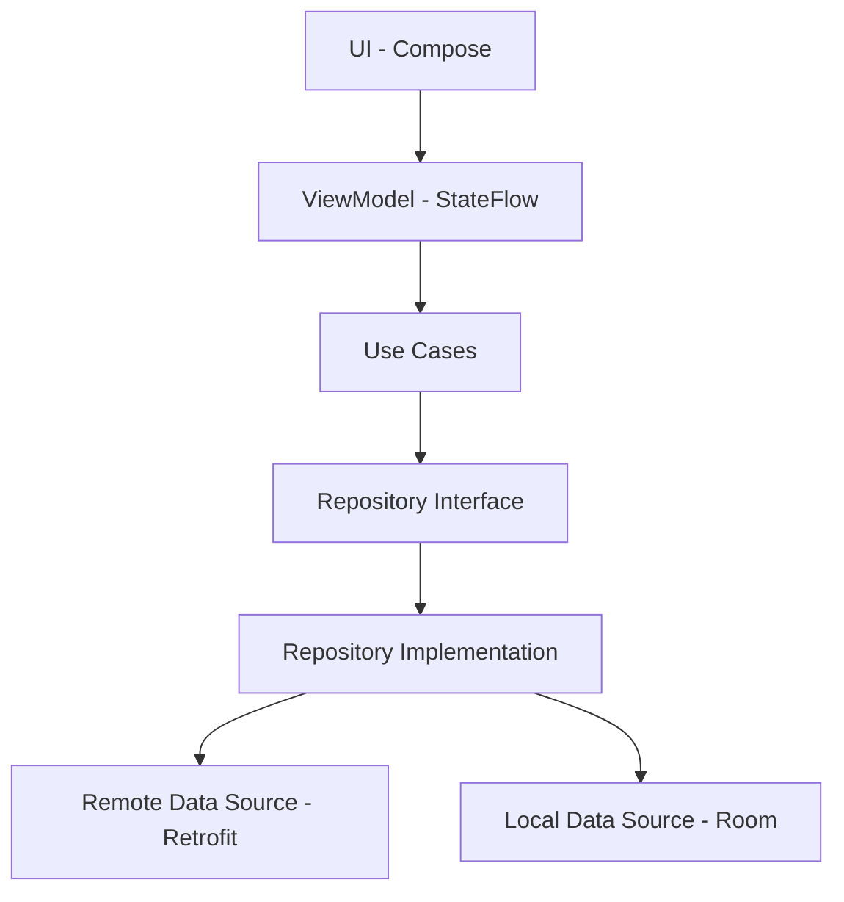

# Implementation Plan - Transfermarket Explorer Architecture

Este plan detalla la implementación de una arquitectura robusta, escalable y siguiendo los principios de Clean Architecture para la aplicación Transfermarket Explorer.

## User Review Required

> [!IMPORTANT]
> Se añadirán múltiples dependencias necesarias para Hilt, Retrofit, Room, Coil y Navigation Compose. Se utilizarán versiones estables compatibles con Kotlin 2.2.10 y Compose BOM 2026.02.01.

> [!WARNING]
> La estructura de paquetes se reorganizará para seguir Clean Architecture, moviendo los archivos de UI existentes a una subcarpeta `ui/theme`.

## Proposed Architecture

Se utilizará una arquitectura de 3 capas con **MVVM** en la capa de presentación:

### Components by Layer

#### 1. Domain Layer (Pure Kotlin)
- **Models**: Clases de datos limpias que representan las entidades del negocio (Country, League, Team, Player).
- **Repository Interfaces**: Contratos que definen las operaciones de datos.
- **Use Cases**: Lógica de negocio específica (ej: `GetLeaguesByCountryUseCase`).

#### 2. Data Layer
- **DTOs**: Modelos para la API (Retrofit + Kotlin Serialization).
- **Entities**: Modelos para la base de datos (Room).
- **Mappers**: Funciones de extensión para convertir entre DTOs/Entities y Domain Models.
- **Repository Implementations**: Lógica para decidir si usar datos locales o remotos (Single Source of Truth).

#### 3. Presentation Layer
- **ViewModels**: Gestión de estado mediante `StateFlow` y eventos de UI.
- **Compose Screens**: Pantallas declarativas usando Material 3.
- **Navigation**: Navegación desacoplada usando Navigation Compose.

---

## Proposed Changes

### [Infrastructure & Dependencies]

#### [MODIFY] [libs.versions.toml](file:///Users/indenova/AndroidStudioProjects/TransfermarketExplorer2/gradle/libs.versions.toml)
Añadir versiones y librerías para:
- Hilt (Dagger Hilt)
- Retrofit & OkHttp
- Kotlin Serialization
- Room
- Coil
- Navigation Compose
- Hilt Navigation Compose

#### [MODIFY] [build.gradle.kts (app)](file:///Users/indenova/AndroidStudioProjects/TransfermarketExplorer2/app/build.gradle.kts)
Aplicar plugins de Hilt y KSP, y añadir todas las dependencias nuevas.

### [Clean Architecture Skeleton]

#### [NEW] [Base packages and DI modules]
Crear la estructura de carpetas y los módulos iniciales de Hilt para Network, Database y Repository.

---

## Scalability Strategy

- **Generic Navigation**: Sistema de navegación basado en rutas que permita profundizar desde Países -> Ligas -> Equipos -> Jugadores de forma recursiva o lineal.
- **Modular Data Source**: Los repositorios estarán diseñados para aceptar identificadores (IDs) en cada nivel, facilitando la adición de nuevas regiones o categorías sin modificar la lógica base.

---

## Verification Plan

### Automated Tests
- Unit tests para Use Cases y Mappers.
- Repository tests usando MockWebServer para la parte remota.
- ViewModel tests con Coroutines Test Dispatcher.

### Manual Verification
- Comprobar que la inyección de dependencias funciona correctamente al arrancar.
- Verificar el flujo de navegación inicial.
- Validar el soporte de Dark Mode y Dynamic Colors en la UI base.
